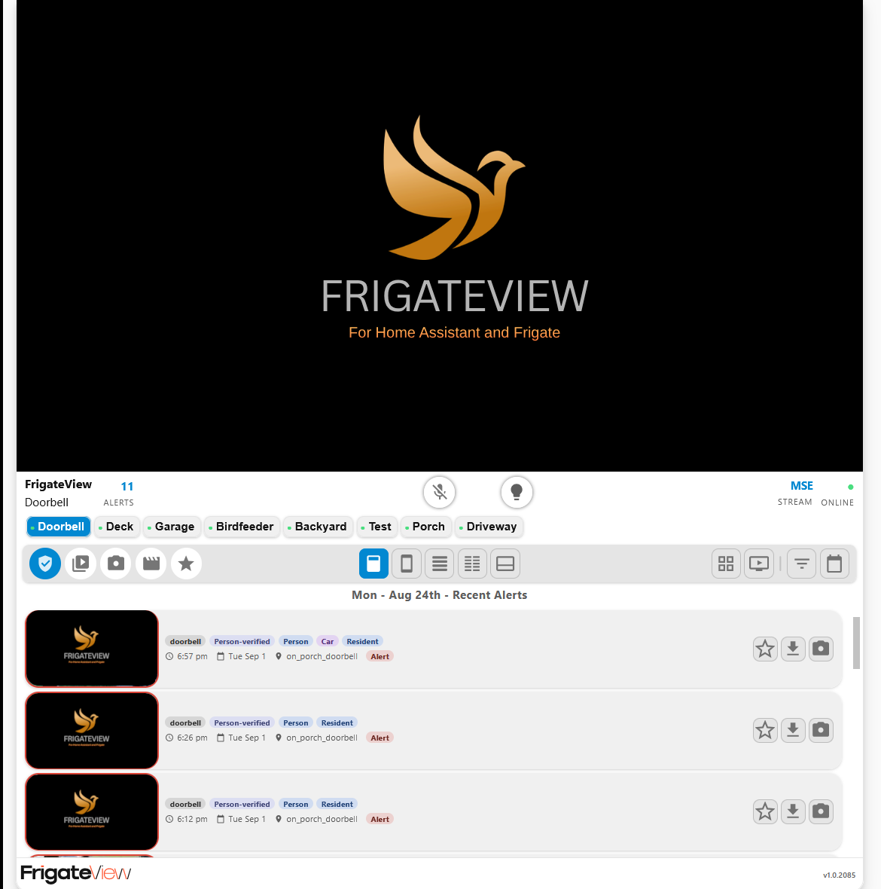
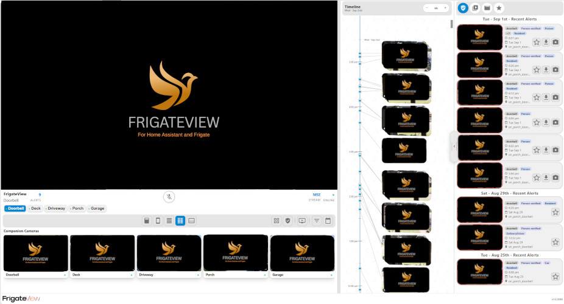
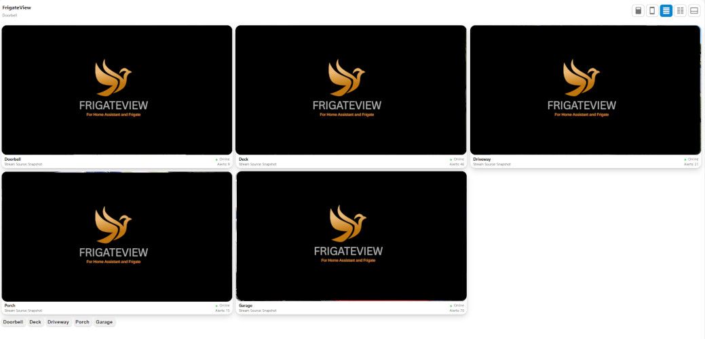
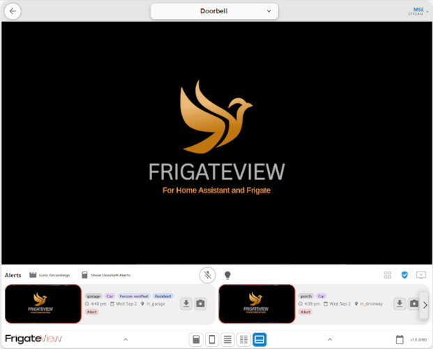

# FrigateViewCard

[](https://github.com/htpchome/FrigateViewCard/releases)
[](#hacs-recommended)
[](LICENSE)
[](https://www.home-assistant.io/)
[](https://frigate.video/)
[](#ai-assisted-development)

FrigateViewCard is a camera, events, and recordings card for Home Assistant and Frigate. It prefers fast WebRTC live playback, supports per-camera transport selection, and provides responsive layouts for desktop, tablet, and phone dashboards.

> [!IMPORTANT]
> FrigateView Card is human-tested with Home Assistant Core 2026.9.0, which is the currently recommended version. Compatibility with earlier Core versions is not verified; friendly bug reports are always welcome.

## Quick Look
FrigateViewCard brings your Frigate cameras, alerts, recordings, PTZ, two-way audio, and mobile camera controls together in a single Home Assistant card.


### AI-assisted development
> [!NOTE]
> This project uses AI as a coding assistant. AI-assisted changes are reviewed and tested by the maintainer before release.

## Features

- Live viewing for up to 12 configured cameras.
- Optional two-camera groups for multi-sensor doorbells, fixed/PTZ pairs, and dual-lens cameras.
- Per-camera `frigate_go2rtc` or `ha_direct` live playback.
- WebRTC-first card-managed live playback with an MSE hedge and snapshot fallback.
- Single View, Mobile View, Preview, Wide View, and naturally sized Card View layouts.
- Alerts, Clips, Snapshots, Recordings, Favorites, filtering, calendar navigation, and progressive list painting.
- Per-camera Alerts-only or All Reviews behavior used consistently by alert lists, borders, live promotion, and camera takeover.
- Optional slideshow and 2x2 rotating Grid modes on non-phone devices, with independent Grid ordering and camera exclusion.
- Alert-driven live promotion on Preview, Grid, Wide View Companion Cameras, and Card View.
- PTZ and two-way talk controls when the camera and selected connection mode support them, including active-talk mute controls and a lightweight desktop audio visualization.
- Per-camera Home Assistant light controls with on/off and supported brightness control.
- Responsive live-video resizing for aspect ratios narrower than 16:9.
- Popup playback with a paged carousel, video and snapshot zoom, recording scrub markers, event snapshot previews, downloads, AirPlay, fullscreen, and supported desktop Picture-in-Picture.
- On-demand downloads of the currently displayed frame, including the current zoom and pan.
- Notification deep links for events, reviews, cameras, clips, and snapshots.
- Home Assistant theme inheritance plus configurable color, border, corner, shadow, margin, and height behavior.

## Requirements

- Home Assistant with the Frigate integration configured.
- One or more Home Assistant `camera` entities associated with Frigate.
- Frigate/go2rtc configured for cameras using the default `frigate_go2rtc` connection type.
- A current browser. Microphone capture and some media features require a secure Home Assistant connection and browser support.

### Frigate integration requirement

The Frigate Home Assistant integration must be installed and configured for FrigateViewCard to function properly. The card uses the integration-provided camera entities, services, media APIs, and Home Assistant-exposed Frigate/go2rtc paths.

On Home Assistant OS, Frigate itself may be installed as a Home Assistant add-on. The add-on runs the Frigate server; it does not replace the Frigate Home Assistant integration. Home Assistant OS users running the Frigate add-on must also install and configure the Frigate integration.

## Installation

### HACS (recommended)

1. Open HACS in Home Assistant.
2. Open the three-dot menu and select **Custom repositories**.
3. Add `https://github.com/htpchome/FrigateViewCard` as a **Dashboard** repository.
4. Find **FrigateView Card** in HACS and install it.
5. Refresh the browser after installation or upgrade.

HACS installs the generated assets from `dist/`. The main resource remains
`frigate-view-card.js`; the editor is loaded when the visual editor opens, and
the versioned HLS.js companion is loaded only when a browser without native HLS
needs it for recording playback. FrigateViewCard and HLS.js license files are
included alongside those assets.

### Manual installation

Home Assistant exposes the `www` folder inside its configuration directory at
the `/local/` URL. On Home Assistant OS, the configuration directory is normally
shown as `/config`, so `/config/www/frigate-view-card/` becomes
`/local/frigate-view-card/` in the browser.

1. Download every file from the `dist` directory of the desired release. Use
   files from the same release; do not mix versions.

2. Inside your Home Assistant configuration directory, create this dedicated
   folder if it does not already exist:

   ```text
   www/frigate-view-card/
   ```

   On Home Assistant OS, the resulting layout should be:

   ```text
   /config/
   └── www/
       └── frigate-view-card/
           ├── frigate-view-card.js
           ├── frigate-view-card-editor.js
           ├── frigate-view-card-hls-1.5.17.js
           ├── frigate-view-card-hls-1.5.17.LICENSE.txt
           └── frigate-view-card.LICENSE.txt
   ```

   Keep all files together in that folder. The main card loads the editor and
   HLS companion file from paths relative to `frigate-view-card.js`. The two
   license files cover FrigateViewCard and its bundled HLS.js dependency.

3. If this is the first time you have created the `www` folder, restart Home
   Assistant once so the `/local/` path is available.

4. In **Settings → Dashboards → Resources**, add:

   - URL: `/local/frigate-view-card/frigate-view-card.js`
   - Resource type: **JavaScript Module**

5. Refresh the browser. After an upgrade, use a hard refresh if the previous
   card version is still shown.

You may place the files directly in `www`, but then all files must still be
siblings and the resource URL would instead be `/local/frigate-view-card.js`.
The dedicated subfolder above is recommended because it keeps this multi-file
card separate from other manually installed resources.

## Quick start

The card includes a visual editor. A minimal YAML configuration is:

```yaml
type: custom:frigate-view-card
cameras:
  - entity: camera.doorbell
```

The visual editor keeps YAML compact. Default values are accepted by the card but omitted from saved YAML until changed.

## Views and modes

| View | Devices | Default | Purpose |
| --- | --- | --- | --- |
| Single View | Desktop, tablet, phone | Always enabled | Main live camera, camera switcher, full browse area, page navigation, and tools. |
| Mobile View | Desktop, tablet, phone | Enabled | Phone-first live view with touch-optimized controls, browsing, talk, PTZ, and Home Assistant navigation options. |
| Preview | Desktop, tablet, phone | Off | All configured cameras as live or refreshed snapshot tiles. Selecting a camera opens the configured destination view. |
| Wide View | Desktop and tablet | Off | Resizable two-column layout with the main live camera, browse area, and all ordered Companion Cameras. |
| Card View | Desktop and tablet | Off | Naturally sized view intended for dashboards that mix FrigateViewCard with other Home Assistant cards. |

Grid, Slideshow, PTZ, and alert-takeover controls are coordinated so incompatible modes cannot be active at the same time. Grid and Slideshow modes are unavailable on phone devices.

### Mobile View

Mobile View turns a phone into a focused Frigate control center. The active camera, camera picker, alerts, clips, recordings, Favorites, and essential live controls share one touch-optimized layout, keeping common actions close without giving up the card's full media browser. PTZ, two-way talk, linked-light controls, fullscreen rotation, A/B camera-group switching, and recording segment downloads are all adapted for smaller screens.

It can also reshape the surrounding Home Assistant experience. Move the Home Assistant dashboard navbar to the bottom for easier reach, optionally stack each icon above its label, and choose whether that layout follows you across the whole dashboard. A designated FrigateViewCard can provide touch swipe navigation through selected FrigateView pages and Home Assistant dashboard pages, with gesture guards for controls, media, horizontal scrollers, and Home Assistant's native left-edge menu gesture.

For a lighter mobile footprint, Preview can hand the selected camera into Mobile View, inactive overview cameras can stay on refreshed snapshots, and Mobile Battery Saver reduces alert and review polling to once per minute.

&nbsp;&nbsp;&nbsp;&nbsp;&nbsp;&nbsp;&nbsp;&nbsp;

### Single View

Single View is the card's always-available camera command center. One live camera stays front and center, backed by fast camera switching, stream and alert status, page navigation, and direct access to mute, fullscreen, snapshots, Picture-in-Picture where supported, linked lights, PTZ, and two-way talk.



Below the live view is the complete Frigate media workflow: Alerts, Clips, Snapshots, Recordings, Favorites, filters, calendar navigation, and feature-rich media popups. On desktop and tablet, Single View can also move into Slideshow or a rotating 2x2 Grid, making it equally comfortable as a dedicated security screen or the dependable home base of a larger dashboard.

### Wide View



Wide View can optionally add a collapsible vertical Timeline beside the browse area. It reuses the active camera's loaded Alert and Event data, follows the calendar and browse filters, and supports 1/6/12/24-hour scales. It begins at the current time, scrolls vertically toward older activity, and keeps time/day labels synchronized with the visible range. Dense activity becomes vertically flippable thumbnail stacks; Alerts receive the alert outline and take precedence over Events at the same point. The responsive panel consumes browse width when space permits and becomes a drawer overlay only after the browse area reaches its protected minimum width.

### Preview

Preview is the at-a-glance camera overview. Every configured physical camera receives its own responsive tile, including separate A/B tiles for grouped cameras, with optional title bars showing the camera name, stream source, Alerts count, and online state. Selecting any tile carries that camera directly into the configured Single View or Mobile View flow.



Preview can keep every tile live, or use refreshed snapshots to deliver a fast overview with far less network and device load. Desktop and mobile live-tile behavior can be configured independently. When a qualifying alert arrives, a snapshot tile can temporarily promote itself to live video, so the camera that matters comes alive automatically without requiring an always-live camera wall.

### Card View

Card View is a desktop/tablet layout designed to sit beside other cards in a Home Assistant dashboard. It uses its content and live-video aspect ratio to determine its natural height, so the global Card Height Limit does not apply.



Its activity drawer sits between the live view and footer. Either footer handle can open or close it by click, touch, or swipe, and `card_view_drawer_default_open` controls its initial state. The drawer can switch between horizontally paged Alerts and active-camera Recordings. Alerts can be scoped to the active camera or mixed across all configured cameras, and the calendar is available in both activity modes. PTZ temporarily replaces the activity row when active.

Card View also supports Grid, Slideshow, alert takeover, two-way talk, linked lights, compact media popups, and conditional footer navigation. With `card_view_standalone` enabled, it becomes the only desktop/tablet view while the phone landing flow remains independently configurable.

## YAML configuration

### General and media options

| Variable | Type | Default | Description |
| --- | --- | --- | --- |
| `cameras` | list | required | Ordered camera definitions. Up to 12 physical camera entities are supported; each two-camera group counts as two. |
| `title` | string | `FrigateView` | Main card title. `{camera}` resolves to the active camera name, or `Grid` in Grid mode. |
| `subtitle` | string | `{Camera}` | Secondary title. `{camera}` or an empty value resolves to the active camera name, or `Grid` in Grid mode. |
| `display_title` | boolean | `true` | Displays the title when enabled. |
| `display_subtitle` | boolean | `true` | Displays the subtitle when enabled. |
| `display_logo` | boolean | `true` | Displays the FrigateView logo in page footers. The footer keeps its normal height when disabled. |
| `display_version` | boolean | `true` | Displays the FrigateView version number in page footers. The editor always shows the running version. |
| `window_days` | number | `3` | Number of recent days containing event data to load for event-media browsing. The editor offers 1–15. |
| `alerts_reviews_days` | number | `window_days` | Number of recent days containing qualifying Alerts/Reviews to load and count. The editor offers 1–15. |
| `realtime_poll_seconds` | number | `5` | How often the card checks for new alerts and reviews when realtime notifications are delayed or missed. Valid values: `2`, `5`, `10`, `15`, `30`, `60`. |
| `mobile_poll_battery_saver` | boolean | `false` | Uses 60-second polling on mobile devices to reduce battery and data use. |
| `snapshot_update_seconds` | number | `60` | Snapshot refresh interval for snapshot-based Preview, Grid, and Wide View Companion Camera tiles. Valid values: `10`, `20`, `30`, `60`, `120`, `300`. |
| `event_pre_post_roll_enabled` | boolean | `false` | Adds 5 seconds before and after Alerts and Clips during popup playback and download when Frigate recording footage is available. |
| `favorites_mixed_cameras` | boolean | `true` | Combines favorites from all configured cameras in Favorites. Set to `false` for the active camera only. |
| `deep_link_enabled` | boolean | `true` | Allows this card instance to consume supported notification URL parameters. Disable on cards that should ignore shared dashboard deep links. |

### Page and mode options

| Variable | Type | Default | Description |
| --- | --- | --- | --- |
| `slideshow_rotation_enabled` | boolean | `false` | Enables main-camera Slideshow rotation on non-phone devices. |
| `slideshow_rotation_seconds` | number | `30` | Slideshow interval. Valid values: `10`, `20`, `30`, `60`. |
| `slideshow_alert_hold_seconds` | number | `10` | Time an alert takeover is held during Slideshow operation. Valid values: `10`, `20`, `30`, `60`, `120`. |
| `grid_mode_enabled` | boolean | `false` | Enables the 2x2 Grid mode on non-phone devices when at least two cameras exist. |
| `grid_order` | object | Default camera order | Optional custom Grid-only camera order. Set `mode: custom`, list visible physical camera entity IDs in `included`, and place Grid-excluded IDs in `excluded`. Camera Settings order is not changed, and grouped A/B members are ordered separately. |
| `grid_start_in_grid_enabled` | boolean | `false` | Starts in Grid mode and returns to it when re-entering the dashboard. |
| `grid_live_view_enabled` | boolean | `true` | Keeps visible Grid cameras live. When disabled, tiles use snapshots and qualifying alerts temporarily promote a tile to live. |
| `grid_rotation_seconds` | number | `30` | Grid-page rotation interval when more than four cameras exist. Valid values: `10`, `20`, `30`, `60`. |
| `grid_alert_hold_seconds` | number | `10` | Time an alerted Grid tile remains promoted. Valid values: `10`, `20`, `30`, `60`. |
| `mobile_view_page_enabled` | boolean | `true` | Enables Mobile View in navigation and eligible landing-page choices. |
| `mobile_view_rotate_to_fullscreen` | boolean | `true` | Expands live and popup media to fullscreen when a supported touch device rotates to landscape. |
| `mobile_view_ha_navbar_bottom` | boolean | `false` | Moves the Home Assistant dashboard navbar to the bottom on phones while Mobile View is active. |
| `mobile_view_ha_navbar_stack_tabs` | boolean | `false` | With the bottom navbar enabled, centers supported Home Assistant page titles beneath their icons. |
| `mobile_view_ha_navbar_dashboard` | boolean | `false` | Keeps the bottom-navbar layout active across the whole dashboard after this card loads. |
| `ha_dashboard_swipe_navigation_owner` | boolean | `false` | Makes this card the one FrigateViewCard responsible for dashboard swipe navigation. Only one card should own it per dashboard. |
| `ha_dashboard_swipe_navigation` | string | `dashboard-wide` | Swipe scope: `dashboard-wide`, `inside-card`, `landing-dashboard`, or `none`. Touch swipes protect interactive controls, media gestures, horizontal scrollers, and Home Assistant's native left-edge gesture. |
| `ha_dashboard_swipe_pages` | list | Preview plus landing page | FrigateView pages included by `dashboard-wide` and `inside-card`; the enabled desktop/tablet landing page is always included. |
| `ha_dashboard_swipe_include_other_cards` | boolean | `false` | In `inside-card` mode, includes eligible FrigateView pages contributed by other cards in the dashboard. |
| `ha_dashboard_swipe_include_subviews` | boolean | `false` | Allows supported dashboard-wide swipe modes to include Home Assistant subviews. |
| `ha_dashboard_swipe_mouse_enabled` | boolean | `false` | Allows a primary-button mouse drag to use the configured swipe navigation. |
| `preview_page_enabled` | boolean | `false` | Enables Preview in navigation and eligible landing-page choices. |
| `preview_page_live_cameras` | boolean | `false` | Keeps all Preview tiles live. When disabled, tiles use refreshed snapshots and qualifying alerts temporarily promote them to live. |
| `preview_page_live_cameras_mobile` | boolean | `false` | Separately keeps Preview tiles live on phone and tablet devices. When disabled, those devices use refreshed snapshots even if desktop Preview tiles are configured live. |
| `preview_page_show_title_bars` | boolean | `true` | Shows camera name, source, Alerts count, and online state beneath Preview tiles. |
| `preview_page_alert_live_duration_seconds` | number | `10` | Shared live-promotion duration for alerted Preview and Wide View Companion Camera tiles. Valid values: `5`, `10`, `20`, `30`, `60`, `120`. |
| `wide_view_page_enabled` | boolean | `false` | Enables Wide View for desktop/tablet navigation and landing-page selection. |
| `wide_view_live_cameras` | boolean | `false` | Keeps all Wide View Companion Cameras live instead of using refreshed snapshots. |
| `wide_view_alert_takeover` | boolean | `false` | Initial state of the runtime control that lets a qualifying Companion Camera alert take over the main live view. |
| `wide_view_timeline_enabled` | boolean | `false` | Enables the collapsible active-camera Timeline beside the Wide View browse area. |
| `wide_view_timeline_default_open` | boolean | `false` | Opens the Wide View Timeline when the view starts instead of leaving it collapsed behind its drawer handle. |
| `wide_view_timeline_default_scale` | number | `12` | Sets the Timeline's initial time range in hours. Supported values are `1`, `6`, `12`, and `24`. |
| `card_view_page_enabled` | boolean | `false` | Enables naturally sized Card View on desktop and tablet. |
| `card_view_alert_takeover` | boolean | `false` | Initial state of the Card View alert-takeover control. |
| `card_view_drawer_default_open` | boolean | `true` | Starts Card View with its Alerts/Recordings drawer open. Footer handles can open or close it at runtime. |
| `card_view_standalone` | boolean | `false` | Makes Card View the only desktop/tablet view and forces it as that device class's landing page. |
| `landing_page` | string | `single-view` | Desktop/tablet landing page. Choices are limited to enabled, supported views. |
| `mobile_page` | string | `single-view` | Phone landing flow: `mobile-view`, `preview-mobile-view`, `preview-single-view`, or `single-view`. Choices requiring Mobile or Preview are available only when those pages are enabled. |

For `preview-mobile-view` and `preview-single-view`, the phone opens Preview first. Selecting a Preview camera then opens Mobile View or Single View with that camera active.

### Grid ordering

Grid mode displays physical cameras in pages of four. Its visual editor offers two order modes:

- **Default** follows Camera Settings order.
- **Custom** reorders or excludes physical cameras without changing Camera Settings, camera switchers, or other views. A two-camera group's A and B members are independent Grid entries.

```yaml
grid_mode_enabled: true
grid_order:
  mode: custom
  included:
    - camera.front_door
    - camera.driveway
    - camera.garage
    - camera.backyard
  excluded:
    - camera.side_yard
```

### Layout and appearance options

| Variable | Type | Default | Description |
| --- | --- | --- | --- |
| `hidden_tabs` | list | `[snapshot]` | Browse tabs to hide. Values: `alerts`, `clips`, `snapshot`, `recordings`, `kept` (Favorites). |
| `stream_height` | number | `100` | Card Height Limit from `50` to `100`. Does not apply to Card View. |
| `stream_height_unit` | string | `%` | Height unit. Values: `%`, `dvh`. |
| `tight_margins` | boolean | `false` | Removes Home Assistant Sections-view padding where available so the card can fill its assigned space. |
| `mobile_view_outer_border` | boolean | `false` | Shows the theme-colored outer border around Mobile View on any device. |
| `shadows` | boolean | `true` | Displays shadows inside the card. |
| `outer_shadows` | boolean | `true` | Displays the shadow around the card. Preview, Wide View, and Mobile View automatically omit it on phones. |
| `borders` | boolean | `true` | Displays borders on event items. |
| `rounded_corners` | boolean | `true` | Enables rounded card and content corners. |
| `col_left_width_pct` | number | `60` | Wide View left-column width. Range: `25`–`75`. |
| `theme` | string | `default` | Uses the Home Assistant theme with `default`, or enables saved overrides with `custom`. |
| `theme_custom` | list | `[]` | One custom theme entry containing its applicable `modes` and supported FrigateViewCard color-token `overrides`. |

### Camera options

Each item in `cameras` supports:

| Variable | Type | Default | Description |
| --- | --- | --- | --- |
| `entity` | string | required | Home Assistant camera entity, such as `camera.front_door`. |
| `name` | string | entity-derived | Camera display name. |
| `connection_type` | string | `frigate_go2rtc` | Live playback owner. Values: `frigate_go2rtc`, `ha_direct`. The visual editor labels these “Frigate go2rtc (default)” and “Home Assistant.” |
| `alerts_content` | string | `alerts_only` | Qualifying review content. Values: `alerts_only`, `all_reviews`. |
| `ptz` | boolean or map | disabled | Enables PTZ pan/tilt controls after Frigate reports compatible PTZ support. A map may include `enabled` and `rotation` (`0`, `90`, `180`, or `270`) to remap directional controls for a rotated image. |
| `two_way_talk` | boolean | `false` | Enables the microphone control. Frigate mode requires a detected backchannel; Home Assistant mode requires WebRTC playback and remains an experimental talkback path. |
| `group` | map | disabled | Groups this main camera with one `secondary_entity`. `layout` is `side_by_side` or `stacked`. |
| `linked_entities` | list | disabled | Linked Home Assistant controls. Currently supports one `light.*` entity with an optional `icon`; the same light may be linked to multiple cameras. |

Example with non-default camera behavior:

```yaml
type: custom:frigate-view-card
cameras:
  - entity: camera.front_door
    name: Front Door
    alerts_content: all_reviews
    two_way_talk: true
  - entity: camera.driveway
    connection_type: ha_direct
    ptz:
      enabled: true
      rotation: 90
preview_page_enabled: true
mobile_view_page_enabled: true
mobile_page: preview-mobile-view
```

Camera order is preserved by camera switchers, Preview, and Wide View Companion Cameras. Grid follows that order in its Default mode or its independent `grid_order` in Custom mode. The selected `connection_type` is also respected by the live tiles on those pages.

### Two-camera groups

The visual editor can add one second camera beneath a main camera. A group has one camera-switcher button and one shared name, connection type, Alerts-content policy, PTZ setting, and two-way-talk setting. PTZ and two-way-talk detection apply only to the main camera, so the controllable camera must be selected first.

```yaml
type: custom:frigate-view-card
cameras:
  - entity: camera.doorbell_main
    name: Doorbell
    two_way_talk: true
    group:
      secondary_entity: camera.doorbell_package
      layout: stacked
```

On desktop and tablet live pages, both members render together with independent zoom/pan and selectable A/B audio. Either member can temporarily fill the live viewport and return to the split layout without remounting the group. Side-by-side groups keep the normal live height; stacked groups use the shared vertical resize grip. A displayed-frame download captures the current grouped presentation. Alerts, Clips, Snapshots, calendar activity, and popup media are mixed across both members. Recordings remain separate chronological A/B rows so overlapping footage is not merged.

Preview and Wide View Companion Cameras show both physical members as separate tiles, while selecting either opens the combined group. Grid and Slideshow also treat the members as separate cameras. To limit phone resource use, Mobile View loads one group member at a time and provides an A/B overlay control to switch the displayed member; grouped browse data remains combined.

### Linked light controls

Each camera configuration can currently link one Home Assistant `light.*` entity. The same light may be linked to multiple cameras. The control uses the entity's Home Assistant friendly name and configured icon; if no custom icon is saved, the entity/default light icon is used.

A normal press toggles the light through Home Assistant. A press-and-hold opens brightness control when the entity reports dimming support. The brightness panel includes power control, and turning the light back on preserves Home Assistant's last brightness behavior. Mobile View presents this as a touch-friendly overlay. Linked lights use Home Assistant services directly and are independent of the camera's `connection_type`.

```yaml
type: custom:frigate-view-card
cameras:
  - entity: camera.front_door
    linked_entities:
      - entity: light.porch
        icon: mdi:coach-lamp
```

## Live playback and controls

The two connection modes are intentionally separate:

- `frigate_go2rtc` lets the card manage live startup, transport choice, and fallback using Home Assistant-exposed Frigate/go2rtc surfaces. Automatic primary live startup races WebRTC with an MSE hedge before falling back to refreshed snapshots; it does not start HLS automatically.
- `ha_direct` delegates playback to Home Assistant's camera stream components and transport decisions.

HLS remains available for explicit compatibility paths and HLS-backed media, but it is not part of the automatic `frigate_go2rtc` primary live race. A healthy WebRTC connection remains preferred.

Live controls vary by view and device and can include mute, fullscreen, Take Snapshot, and Picture-in-Picture. Picture-in-Picture is intentionally hidden on mobile devices. On phones and tablets, video controls appear after tapping the unzoomed media. Physical device rotation remains the source of the mobile rotation-fullscreen behavior.

For live sources narrower than 16:9, a subtle resize grip can extend the live area vertically. The live area cannot be dragged taller than its width.

Two-camera groups add per-pane audio selection and focus controls on desktop/tablet, or an A/B source switch on phones. Zoom interaction is limited to the displayed video surface rather than its letterboxed background.

## Browse tabs and media popup

- **Alerts** uses Frigate Reviews and the active camera's `alerts_content` setting.
- **Clips** displays events with clip media.
- **Snapshots** displays snapshot media and is hidden by default.
- **Recordings** provides day-based recording navigation, progressive loading, and a segmented scrub bar for Alerts and Detections.
- **Favorites** uses Frigate's retained/favorite event state and defaults to a mixed-camera list.

The Alerts counters shown for cameras count qualifying Reviews across the configured number of active Alerts/Reviews days. Empty calendar days do not consume that count window.

Browse actions follow the displayed media:

| Item | Actions when media exists |
| --- | --- |
| Alert or Clip | Favorite, Download Clip, View Snapshot |
| Snapshot | Favorite, Download Snapshot, View Clip |
| Favorite | Favorite plus the matching clip/snapshot download and cross-navigation actions |

The popup preserves the selected media type, supports zoom for both videos and snapshots, and sizes itself to the media's intrinsic aspect ratio. Recording markers show an event snapshot preview on hover. Carousel arrows and touch swipes advance by one visible page rather than one item.

When an event thumbnail cannot load, browse items can try the corresponding Frigate Review thumbnail when one is available, then fall back to a consistently sized placeholder. The card does not decode clip video merely to synthesize a list thumbnail.

If Frigate reports a clip that cannot be played, the popup attempts to show the event snapshot with a clear **Clip unavailable** notice. If neither the clip nor snapshot can be loaded, it displays an explanatory missing-media state instead of a broken media element. The card does not copy favorite media outside Frigate, so Frigate's configured retention and available files remain authoritative.

## PTZ and two-way talk

- PTZ is enabled per camera and shown only after Frigate reports compatible pan/tilt capability.
- Both live connection modes use the Home Assistant Frigate integration's `frigate.ptz` control service. With `ha_direct`, Home Assistant still owns video playback; PTZ remains an explicit, separate Frigate control path.
- The main PTZ control uses a circle pad with capability-aware continuous pan/tilt and card-managed display zoom controls.
- `ptz.rotation` remaps the visible direction controls without rotating video or changing camera motion timing. At `90`, the visible Up control sends Left, matching a 90-degree rotated image.
- Camera presets reported by Frigate appear as recall chips beneath the main PTZ pad. A preset named `Home` is identified as Home; the first preset is never assumed to be Home. The card recalls reported presets but does not create or overwrite presets on the camera.
- Card View uses a compact four-direction PTZ panel in place of its Alerts/Recordings row while PTZ is active.
- In `frigate_go2rtc`, two-way talk is enabled only after a compatible backchannel is detected; this established path is unchanged.
- In `ha_direct`, the editor offers an experimental two-way-talk option only when Home Assistant reports WebRTC playback. Home Assistant does not expose a standard talkback capability, so successful outgoing audio still depends on the camera stream's backchannel and cannot be guaranteed before connection. The browser must grant microphone access.
- Starting two-way talk automatically unmutes playback so both sides can be heard. While a session is active, its inline mute control synchronizes playback and microphone muting without ending the talk connection; the microphone button still ends the session.
- On desktop Single and Wide View, an active talk session shows a lightweight canvas visualization for microphone and incoming audio levels. It is intentionally omitted from Card View, Mobile View, phones, and tablets.

## Custom theme colors

Set `theme: custom` and add only the colors that should differ from the active Home Assistant theme. A custom theme has one color set. Its `modes` array controls whether that same set is active in Home Assistant light mode, dark mode, or both. In the visual editor, a new custom theme initially selects the mode currently active in Home Assistant; changing Light, Dark, or Both does not change the color-picker values.

```yaml
type: custom:frigate-view-card
cameras:
  - entity: camera.front_door
theme: custom
theme_custom:
  - modes:
      - light
      - dark
    overrides:
      --c-bg-main: "#101418"
      --c-bg-primary: "#161c22"
      --c-text: "#f5f7fa"
      --c-accent: "#3b82f6"
```

Only one `theme_custom` entry is used. The earlier light/dark map format is not migrated into this array schema.

Supported keys:

| Variable | Controls |
| --- | --- |
| `--c-bg-main` | Main card background |
| `--c-bg-primary` | Primary card surface |
| `--c-bg-panel` | Secondary panel background |
| `--c-bg-deep` | Video/deep background |
| `--c-bg-mobile` | Mobile and neutral control surface |
| `--c-bg-mobile-list` | Mobile View browse-item surface |
| `--c-bg-list` | Browse items and supporting surfaces |
| `--c-bg-cam-btn` | Camera-switcher button background |
| `--c-text` | Primary text |
| `--c-text2` | Secondary text |
| `--c-text3` | Tertiary/inactive text |
| `--c-text4` | Disabled/fourth text |
| `--c-text-rev` | Reverse text |
| `--c-border` | Primary border |
| `--c-border2` | Secondary border |
| `--c-primary` | Primary action color |
| `--c-primary-l` | Light primary color |
| `--c-primary-d` | Dark primary, hover, and active color |
| `--c-accent` | Accent color |
| `--c-on` | Online, enabled, and available-state accents |
| `--c-off` | Offline and unavailable-state accents |
| `--c-bg-scrub` | Recording scrub background |
| `--c-bg-detect` | Detection markers and detection accents |
| `--c-bg-alert` | Alert and scrub-marker color |

## Notification deep links

FrigateViewCard can open specific media from Home Assistant notification tap-action URLs.

Supported parameters:

- Event: `event`, `event_id`, `frigate_event`, `frigate_event_id`
- Review: `review`, `review_id`, `frigate_review`, `frigate_review_id`
- Camera hint: `camera`, `cam`, `camera_entity`
- Media hint: `media`, `view`, `open` with `snapshot` or `clip`

Behavior:

- Event links open the matching event popup.
- Review links resolve the first detection event in that review and open its popup.
- `media=snapshot` opens the snapshot; `media=clip` prefers the clip when one exists.
- A camera hint switches to the matching configured camera first.
- Desktop/tablet deep links open Single View for playback.
- Phone deep links open Mobile View for `mobile-view` and `preview-mobile-view`, or Single View for `single-view` and `preview-single-view`.
- On dashboards with multiple FrigateView cards, a camera hint lets the card containing that camera consume the link.
- Supported parameters are removed from the browser URL after the target is opened.

Tap-action examples using common Frigate Notifications blueprint variables:

- Event Clip with Review Clip fallback: `/YOUR_DASHBOARD/YOUR_VIEW?camera={{camera}}&event={{id}}&review={{review_id}}`

- Snapshot with Review Snapshot fallback: `/YOUR_DASHBOARD/YOUR_VIEW?camera={{camera}}&event={{id}}&review={{review_id}}&media=snapshot`

*I use the Frigate Notifications by SgtBatten and it works well with the above links, but it can be difficult at first to add the url.  I add to the "Tap Action URL" and the "Action Button 1 icon - iOS Only".  You can't use the dropdown selections, so you have to enter the url in the "search box" then hit the "+ add custom item" button below it.*

The dashboard and view path are not hardcoded. Query parameters are read from both the normal URL query and hash-based Home Assistant routes containing query parameters.

## Alerts Area Content (per camera)

Frigate Reviews can be classified as Alerts or Detections. Each camera has an **Alerts Area Content: All Reviews** setting:

- Off/default (`alerts_only`): only Reviews classified as Alerts qualify.
- On (`all_reviews`): both Alerts and Detections qualify.

This setting controls more than the Alerts browse list. It also determines which Reviews contribute to Alerts counters and which can trigger alert borders, temporary live promotion, Slideshow behavior, and Wide View/Card View camera takeover.

## Legacy configuration

| Variable | Notes |
| --- | --- |
| `camera_entity`, `camera`, `entity`, `entities` | Older camera formats are normalized into `cameras`. New configurations should use `cameras`. |
| `window_hours` | Legacy event window. New configurations should use `window_days`. |
| `refresh_seconds` | Legacy background refresh interval with a minimum of 15 seconds. Realtime polling is controlled by `realtime_poll_seconds`. |
| `wide_view` | Legacy Wide View enablement alias. New configurations should use `wide_view_page_enabled`. |
| `reviews` in `hidden_tabs` | Normalized to `alerts`. New configurations should use `alerts`. |

The removed `disable_hls_desktop` camera option is no longer supported or written by the visual editor.

## Development

Editable source lives in `src/`. Generated Home Assistant/HACS assets live in
`dist/`; do not edit them directly.

```bash
npm install
npm run build
npm test
```

Run `npm run build` after changing application source and before testing or packaging a release.

Before changing the visual editor, configuration persistence, or editor preview,
read the [Configuration Editor Contract](docs/config-editor-contract.md).

## Support

I get tired doing all this work stuff, if you like this card you can help keep me awake!
[](https://ko-fi.com/htpchome/tip)

[ko_fi_shield]: https://img.shields.io/static/v1.svg?label=%20&message=Ko-Fi&color=F16061&logo=ko-fi&logoColor=white
[ko_fi]: https://ko-fi.com/htpchome/tip

## Acknowledgments

This project originally started as a fork of [frigate-modern-hass-card](https://github.com/QuadNL/frigate-modern-hass-card) by [QuadNL](https://github.com/QuadNL). The codebase has since been rewritten and evolved independently, while retaining appreciation for the ideas that inspired the project.
